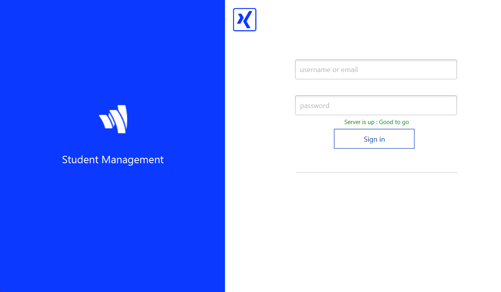
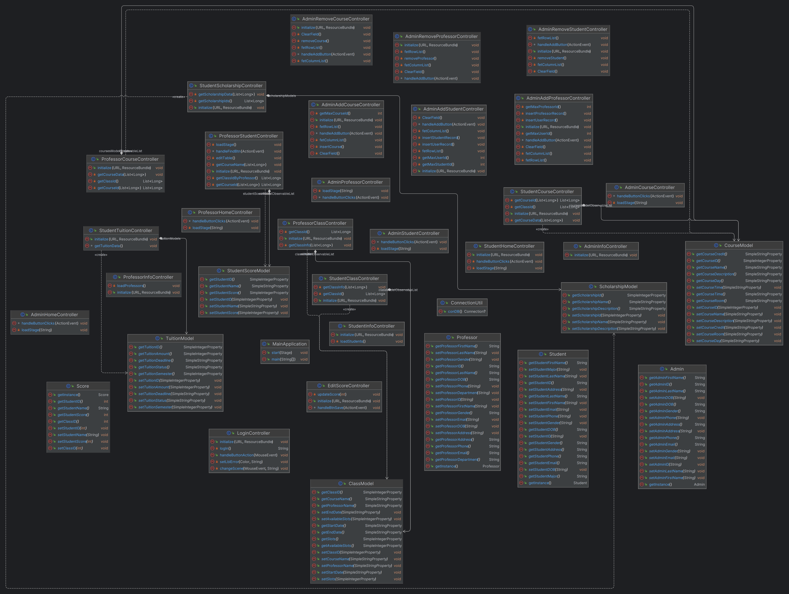
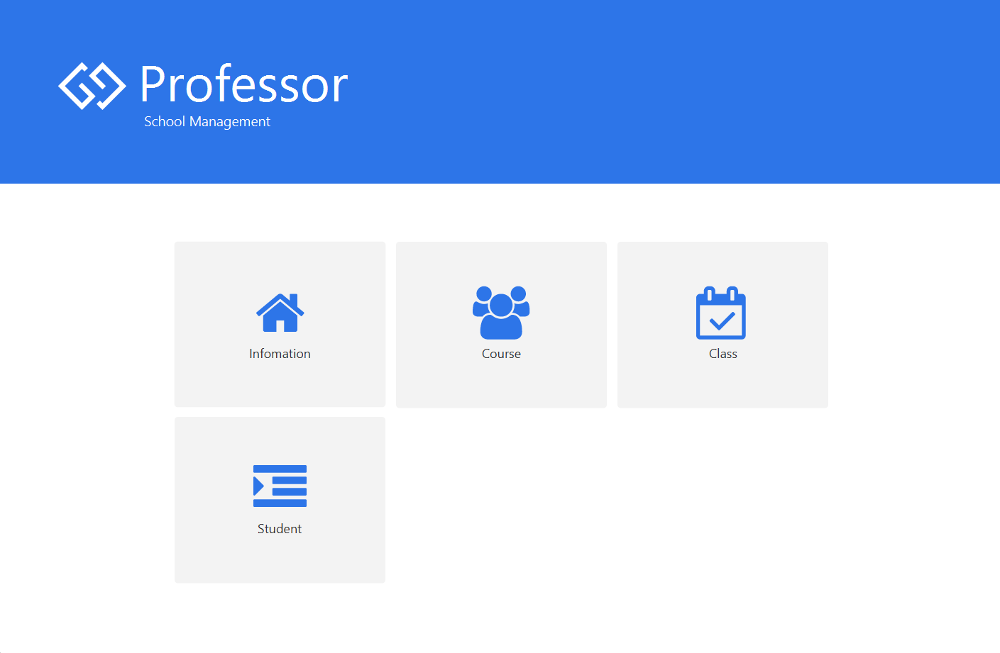

<h1 align="center"> SOLUTION FOR SAVING STUDENT RECORDS </h1>
<h3 align="center"> PRINCIPLES OF DATABASE MANAGEMENT PROJECT </h3>

 
  

<h2 id="about-the-project"> :pencil: About The Project</h2>
<h3 id="uml"> UML </h3>
  
  
<h3 id="features"> Features </h3>
  <h4> Admin </h4> 
    
 
      
    

    <!-- <ul>
      <li>View information (Account, Student, Proffesor)</li>
    </ul> -->
  <h4> Student </h4>
    
 
      
    

    <!-- <ul>
      <li>View information</li>
      <li>View information</li>
    </ul> -->
  <h4> Proffesor </h4>
    
 
      
    

  
